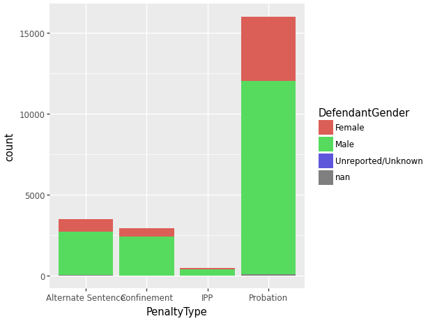

# Example Analysis


## Analysis

``` python
import polars as pl
from plotnine import *

df = pl.read_parquet("../_to-parquet/out/MDJS_SentenceData.parquet")
cases = pl.read_parquet("../_to-parquet/out/MDJS_CaseData.parquet")

(
    df
    .join(cases, "DocketNumber")
    .group_by("PenaltyType", "DefendantGender")
    .agg([pl.count()])
    >> ggplot(aes("PenaltyType", "count", fill="DefendantGender")) + geom_col() 
)
```

    /var/folders/r4/5821nk2d3nv2q7vr8v6gg5f00000gn/T/ipykernel_21886/3003502142.py:11: DeprecationWarning: `pl.count()` is deprecated. Please use `pl.len()` instead.


